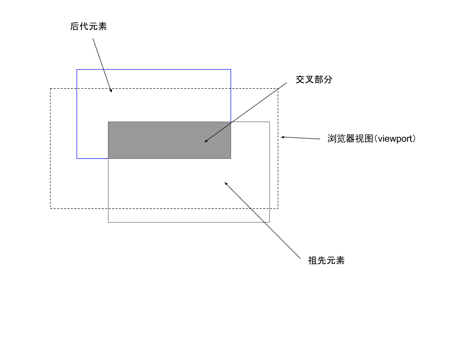

# IntersectionObserver API 剖析
> 元素交叉观察器

## 理论

### 元素交叉现象

浏览器里面，元素都是一个个矩形，当两个元素的盒模型发生重叠现象时，我们称之为“元素交叉”。

这个 API 只观察祖先元素和后代元素之间产生的交叉现象，并且后代元素不能脱离文档流。所以这个 API 设计初衷也就是观察这类交叉现象，对于其他交叉现象，这个 API 是无效的。

* [兄弟节点观察的例子](./demo/ch1/not-parent.html)
* [父节点单独脱离文档流观察的例子](./demo/ch1/parent-not-in-dom.html)
* [子节点脱离文档流观察的例子](./demo/ch1/not-parent.html)

### 交叉现象中值得研究的量

祖先元素和后代元素交叉现象如下图所示：


其中，元素左上角的点距离浏览器视图左上角的点的水平距离为 left、垂直距离为top，元素右下角的点距离浏览器视图左上角的点的水平距离为 right、垂直距离为 bottom。于是，我们可以分别获取祖先元素和后代元素的两组 (top, left, right, bottom) 信息，有了这些信息，我们就可以对祖先元素和后代元素进行定位。

另外，元素的 width、height 可以很方便的对元素的面积进行计算，这两个信息也是我们想要的。祖先元素和后代元素交叉的关系是由图中交叉部分的矩形决定的，我们同样可以获得这个矩形的 top、left、right、bottom、width、height 的值来帮助我们。

最后，我们需要两个明确的量来衡量交叉现象——是否交叉和交叉程度，于是我们衍生出了判断是否交叉的量 isIntersecting 和交叉率 intersectionRatio，交叉率就是用交叉部分的面积除以祖先元素的面积得出，这个量确实很能表现交叉程度。

以上的量都很好的描述了一个交叉现象，但这仅仅是一个静态的描述，如果我们需要一个动态的描述的话，实际上就像三维空间进入四维时空一样，仅仅需要引入一个维度——时间。一个动态的过程就会被描述为一系列不同时间点所对应的静态的量。

至此，我们就能在我们所处的四维时空中很好的描述一个交叉现象。哦，别忘了，祖先元素和后代元素也需要明确，我们可以直接用现成的 DOM 节点来描述。

## 实现

现在，明白了该 API 生效的条件和一个交叉现象是如何描述的，我们就从用这个 API 生成一个交叉现象观察器。

### 创建一个交叉现象观察器

创建一个交叉现象观察器很简单，只需要用 `new` 运算符调用这个 API 就行了。这个 API 接收两个参数，一个是回调函数，一个是配置对象。如下所示：

```javascript
/**
 * @param {Function} callback 可见性变化时的回调函数
 * @param {Object} configs 配置对象
 * @param {Array} configs.threshold 数组内的每一项是数字类型，例如 [0, 0.5, 1]，表示监测交叉率 intersectionRatio 变化到 0，0.5，1 时会执行回调函数，默认是 [0]
 * @param {DOM} configs.root 定义祖先元素，默认是浏览器视图，可以当作是 window
 * @return {Object} 观察器实例
 */
let io = new IntersectionObserver(callback, configs)

// 观察器实例使用方法
// 1. 确定观察的 DOM 元素后开始观察
var target = document.querySelector('.target')
io.observe(target)
// 2. 如果还有其他需要观察的 DOM 元素并且回调执行的函数相同，则多次调用 .observe 方法即可
var another = document.querySelector('.another')
io.observe(another)

// 停止观察某个元素
io.unobserve(element)
// 关闭观察器
io.disconnect()
```

首先，我们上面研究到了两个必不可少的量——祖先元素和后代元素。一个 observer 实例只有一个祖先元素，在 configs.root 里面定义。不过，一个 observer 实例可以观察多个后代元素，调用 .observe 方法时确定。

### 回调函数什么时候执行

那么，回调函数什么时候会执行呢？我们回忆一下上面那些量中哪一个更容易反映交叉现象的变化情况，当然是交叉率了！于是，我们很容易想到回调函数的触发应当与交叉率满足某个情况有关。事实也是如此，我们可能会预先设置一些条件来定制回调函数触发的规则，这些规则在 configs.threshold 里面设置，用一个数组表示，数组里是一些交叉率的数值。我们很容易就想到当交叉率满足里面某个数值的时候回调函数就会执行，可是事实上并不能这么做。

> 注意：我们已经知道了第一个 configs 里面的属性——threshold，请回到上面 observer 生成例子的参数说明中详看它的定义

为什么呢？打个比方，我设置 threshold 为 [0, 0.5, 1]，那么我现在的交叉率 intersectionRatio 为 0.6，我变化到 0.5，回调函数执行一次，然后又变化到 0.6 再变化到 0.5，按照我们想的，回调函数又会执行一次，那我频繁在这个区间波动，回调函数都会执行，我甚至一直在 0.5 的地方停止不动，观察者观察到这个条件一直满足，那就会一直执行，这样的效率是很低的。所以，观察者实例内部为所有的后代元素维护着一个上次交叉率previousThreshold 的字段，在执行 .observe() 的时候会给 previousThreshold 赋初始值 0，然后每次检测到新的相交率满足（到达或跨过）了 thresholds 中某个指定的临界值，且那个临界值和当前的 previousThreshold 值不同，就会触发回调，并把满足的那个新的临界值赋值给 previousThreshold，依此反复。

不过，我们还需要注意一个点，那就是现实世界时间是连续的，但是在计算机中我们都是模拟的连续，所以时间这个维度实现起来并不能和理论上的时间一直，也就是观察者不可能连续的观察交叉率的变化。这里，我们从浏览器的渲染机制讲起，我们常见的显示器都是 60hz 的，就意味着浏览器每秒需要绘制 60 次（60fps），大概每 16.667ms 绘制一次。如果你使用 200hz 的显示器，那么浏览器每 5ms 就要绘制一次。我们把 16.667ms 和 5ms 这种每次绘制间隔的时间段，称之为 frame（帧）。每次绘制完后观察者才会再观察一次，如果上一帧交叉率是0，下一帧是 1，那么中间满足 0.5 的条件不会触发回调函数，只有满足 1 的条件才会触发回调函数，也就是说，每一帧观察者观察一次，如果有满足条件的最近值（这个最近值是 threshold 值在变化前的 previousThreshold 值和当前交叉率区间内的值中减去当前交叉率的绝对值中最小的那个），比如Threshold设置为[0,0.2,0.4,0.6,0.8,1]，第一帧intersectionRatio是0，,第二帧是0.7，那么就只执行一次，而不是0.2,0.4,0.6都各执行一次。

### 回调函数执行的临界情况

通过上面，我们知道 previousThreshold 值初始就为 0，如果 thresholds 中也设置了 0 为条件的话，那么祖先元素和后代元素没交叉的交叉率为 0 和 刚接触的交叉率为 0 的情况下岂不是都会执行回调函数？显然浏览器没这么傻，这种情况交叉率就没那么有用了，我们上面讨论的理论部分中提到的 top、left、right、bottom 反倒能判断两个元素是否刚好接触，所以配上这个判断才能完整的补上这种临界情况，而浏览器也是这么判断的，为了方便我们直接知道结果，浏览器会直接给我们一个 isIntersecting 这个布尔值来让我们判断。同样的，后代元素宽或高为 0 时，也会通过各种量去分析有没有交叉或刚好接触，只有满足这些情况才会执行回调函数。

### 不改变布局的情况下扩大祖先元素的面积

有时候，我们想回调函数在我们视觉交叉之前就开始执行，于是，我们可以配置 configs.rootMargin 来扩大祖先元素的面积（虽然视觉上没变）。

### 回调函数接收的参数是什么样

回调函数共有两个参数，第二个参数就是观察者实例本身，一般没用，因为实例通常我们已经赋值给一个变量了，而且回调函数里的 this 也是那个实例。第一个参数是个包含有若干个 IntersectionObserverEntry 对象的数组。每个 IntersectionObserverEntry 对象都代表一次相交，它的属性们就包含了那次相交的各种信息。entries 数组中 IntersectionObserverEntry 对象的排列顺序是按照它所属的目标元素当初被 observe() 的顺序排列的。

## 实际应用

* [滚动加载](./demo/ch2/slide.html)
* [懒加载](./demo/ch2/lazyload.html)